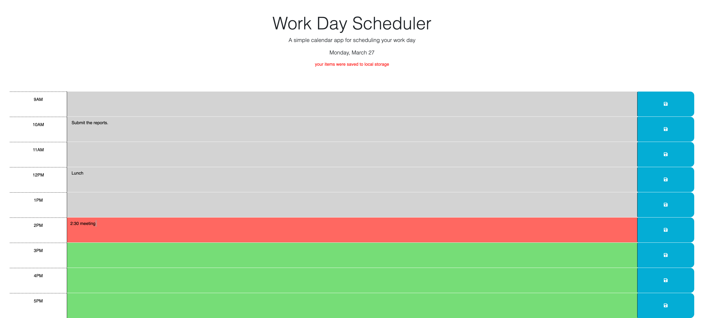

# Workday Planner

## Description
The reason for this application is to help the user plan the workday by writing down appointments for the day to the corresponding time block also helps the user by color coding the textareas corresponding with the time allowing the user to be more organized not only with their appointments but with their time management. the application will also update to the current date on the header.

## Installation
N/A

## Usage
To use this application go to the corresponding time box the user will like to update. the time boxes are color coded with grey time boxes representing the past red the present and green the future. when the user updates the time box(s) they want they'll click the corresponding save button(s) and it will save to local storage. if the user wants to delete what they wrote down click the button again and if whats on the textarea matches local storage it will be deleted.
heres a link to the application https://sam-dejesus.github.io/Workday-planner/
and heres pictures of the application 

## Credits
N/A

## License
Refer to the repo.
